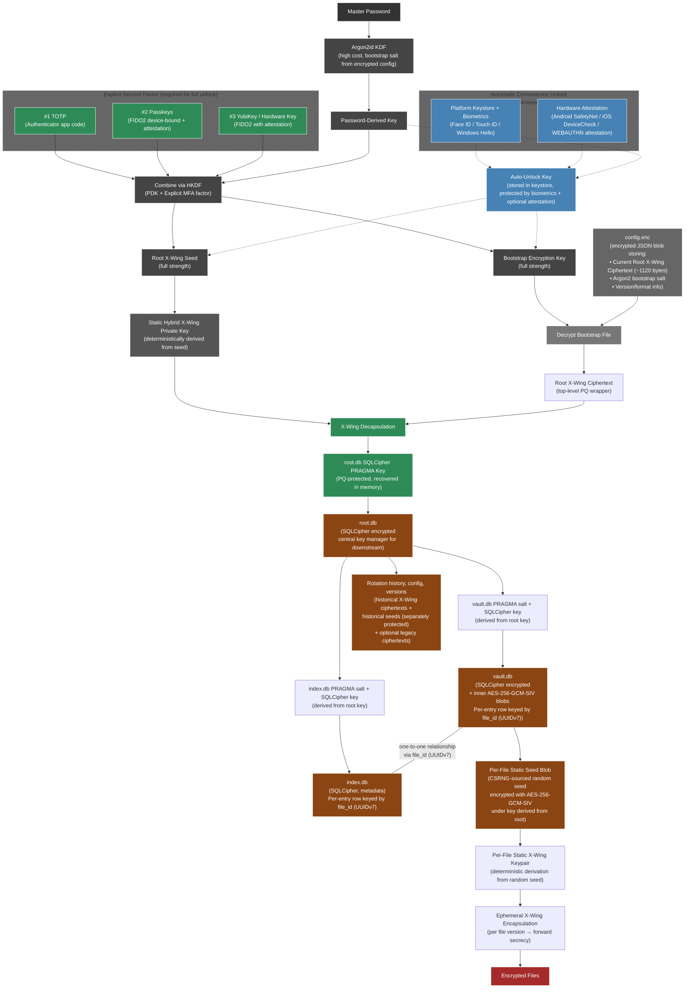

```mermaid
graph TD
    MP["Master Password"] --> Argon["Argon2id KDF<br/>(high cost, bootstrap salt from encrypted config)"]
    Argon --> PDK["Password-Derived Key"]

    subgraph MFA ["Explicit Second Factor (required for full unlock)"]
        direction TB
        TOTP["#1 TOTP<br/>(Authenticator app code)"]
        Passkey["#2 Passkeys<br/>(FIDO2 device-bound + attestation)"]
        YubiKey["#3 YubiKey / Hardware Key<br/>(FIDO2 with attestation)"]
    end

    TOTP --> CombineExplicit
    Passkey --> CombineExplicit
    YubiKey --> CombineExplicit

    PDK --> CombineExplicit["Combine via HKDF<br/>(PDK + Explicit MFA factor)"]

    subgraph Auto ["Automatic Convenience Unlock<br/>(on trusted devices only)"]
        direction TB
        Keystore["Platform Keystore + Biometrics<br/>(Face ID / Touch ID / Windows Hello)"]
        Attestation["Hardware Attestation<br/>(Android SafetyNet / iOS DeviceCheck / WEBAUTHN attestation)"]
    end

    Keystore -.-> AutoCombine
    Attestation -.-> AutoCombine

    PDK -.-> AutoCombine["Auto-Unlock Key<br/>(stored in keystore, protected by biometrics + optional attestation)"]

    CombineExplicit --> BEK["Bootstrap Encryption Key<br/>(full strength)"]
    CombineExplicit --> RootXWingSeed["Root X-Wing Seed<br/>(full strength)"]

    AutoCombine -.-> BEK
    AutoCombine -.-> RootXWingSeed

    BEK --> DecryptBootstrap["Decrypt Bootstrap File"]
    ConfigEnc["config.enc<br/>(encrypted JSON blob storing:<br/>• Current Root X-Wing Ciphertext (~1120 bytes)<br/>• Argon2 bootstrap salt<br/>• Version/format info)"] --> DecryptBootstrap
    DecryptBootstrap --> RootCT["Root X-Wing Ciphertext<br/>(top-level PQ wrapper)"]

    RootXWingSeed --> StaticSK["Static Hybrid X-Wing Private Key<br/>(deterministically derived from seed)"]

    StaticSK --> Decaps["X-Wing Decapsulation"]
    RootCT --> Decaps
    Decaps --> RootKey["root.db SQLCipher PRAGMA Key<br/>(PQ-protected, recovered in memory)"]

    RootKey --> rootDB["root.db<br/>(SQLCipher encrypted<br/>central key manager for downstream)"]

    rootDB --> VaultKey["vault.db PRAGMA salt + SQLCipher key<br/>(derived from root key)"]
    rootDB --> IndexKey["index.db PRAGMA salt + SQLCipher key<br/>(derived from root key)"]
    rootDB --> History["Rotation history, config, versions<br/>(historical X-Wing ciphertexts +<br/>historical seeds (separately protected)<br/>+ optional legacy ciphertexts)"]

    VaultKey --> vaultDB["vault.db<br/>(SQLCipher encrypted<br/>+ inner AES-256-GCM-SIV blobs<br/>Per-entry row keyed by file_id (UUIDv7))"]
    IndexKey --> indexDB["index.db<br/>(SQLCipher, metadata)<br/>Per-entry row keyed by file_id (UUIDv7)"]

    vaultDB -- "one-to-one relationship<br/>via file_id (UUIDv7)" --- indexDB

    vaultDB --> SeedBlob["Per-File Static Seed Blob<br/>(CSRNG-sourced random seed<br/>encrypted with AES-256-GCM-SIV<br/>under key derived from root)"]
    SeedBlob --> PerFileStatic["Per-File Static X-Wing Keypair<br/>(deterministic derivation from random seed)"]
    PerFileStatic --> Ephemeral["Ephemeral X-Wing Encapsulation<br/>(per file version → forward secrecy)"]
    Ephemeral --> Files["Encrypted Files"]

    style MP fill:#333,stroke:#fff,color:#fff
    style Argon fill:#444,stroke:#fff,color:#fff
    style PDK fill:#444,stroke:#fff,color:#fff
    style MFA fill:#666,stroke:#aaa,stroke-dasharray: 5 5
    style TOTP fill:#2e8b57,stroke:#fff,color:#fff
    style Passkey fill:#2e8b57,stroke:#fff,color:#fff
    style YubiKey fill:#2e8b57,stroke:#fff,color:#fff
    style Auto fill:#666,stroke:#aaa,stroke-dasharray: 5 5
    style Keystore fill:#4682b4,stroke:#fff,color:#fff
    style Attestation fill:#4682b4,stroke:#fff,color:#fff
    style CombineExplicit fill:#444,stroke:#fff,color:#fff
    style AutoCombine fill:#4682b4,stroke:#fff,color:#fff
    style BEK fill:#444,stroke:#fff,color:#fff
    style ConfigEnc fill:#666,stroke:#fff,color:#fff
    style DecryptBootstrap fill:#777,stroke:#fff,color:#fff
    style RootXWingSeed fill:#444,stroke:#fff,color:#fff
    style StaticSK fill:#555,stroke:#fff,color:#fff
    style Decaps fill:#2e8b57,stroke:#fff,color:#fff
    style RootKey fill:#2e8b57,stroke:#fff,color:#fff
    style rootDB fill:#8b4513,stroke:#fff,color:#fff
    style vaultDB fill:#8b4513,stroke:#fff,color:#fff
    style indexDB fill:#8b4513,stroke:#fff,color:#fff
    style SeedBlob fill:#8b4513,stroke:#fff,color:#fff
    style Files fill:#a52a2a,stroke:#fff,color:#fff
    style History fill:#8b4513,stroke:#fff,color:#fff
```